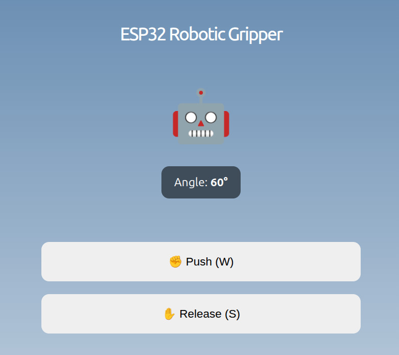
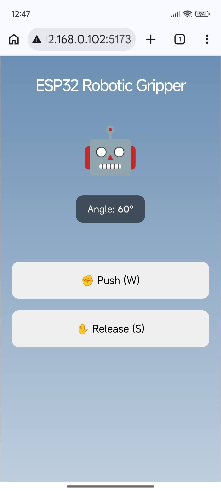

## Description

Frontend (React)

A web interface for controlling the robotic gripper in real-time.

## Features:

- Buttons and keyboard controls (W/S) to grab/release the gripper
- Communicates with the backend via WebSockets for live updates

## Installation

```bash
npm i
```

```bash
npm run dev
```

Open [http://localhost:5173](http://localhost:5173) with your browser to see the
result.

## UI

<div align="center">
  <h3>Web</h3>
  
</div>

<hr>

<div align="center">
  <h3>Mobile</h3>
  
</div>
